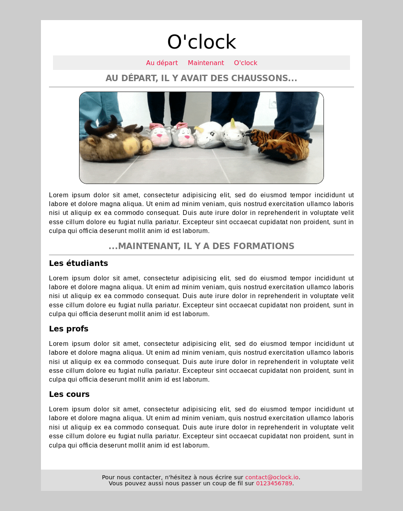

# Exo Box-model

Voici une petite intégration (qui parle à tout le monde) pour apprivoiser le concept de BoxModel.

Mais avant de commencer à coder, on va essayer de standardiser les styles par défaut de navigateurs pour chaque balise HTML.  
En effet, il existe des petites différences d'un navigateur à l'autre, et ça peut rapidement devenir une prise de tête pour l'intégrateur.
Une des solutions ? => https://meyerweb.com/eric/tools/css/reset/

:bulb: **Tip**  
On peut personnaliser ce fichier avec des propriétés CSS génériques super utiles, quel que soit le site :nerd_face:

